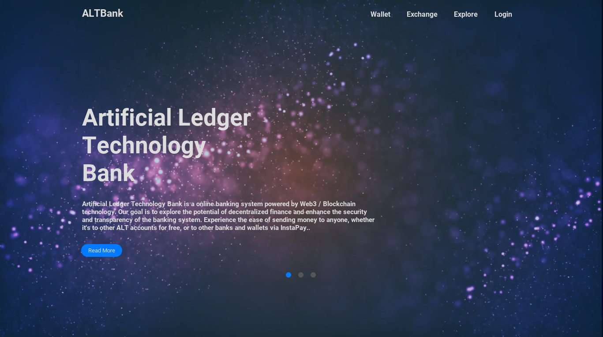
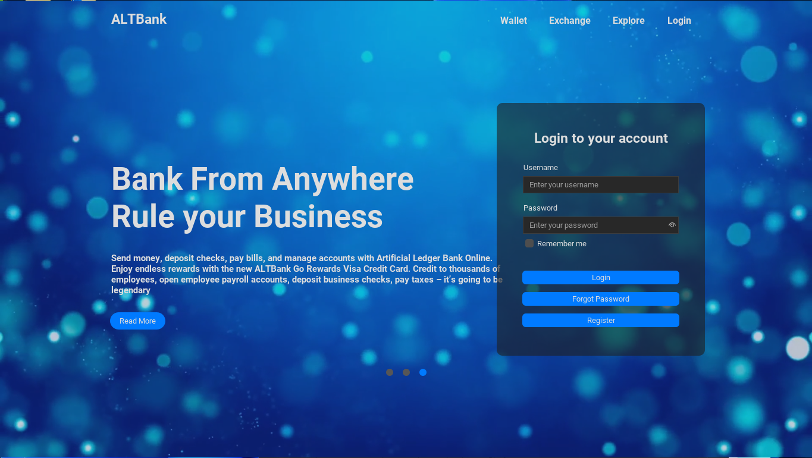

# 💫 CCPRGG2L INTERMEDIATE PROGRAMMING COM23P 

  
### Group Name: [Artificial Ledger Technology](https://github.com/Artificial-Ledger-Technology)  🇵🇭
### Subject & Section: 🧚‍♂️ [CCPRGG2L COM23P](https://www.youtube.com/watch?v=dQw4w9WgXcQ) 🧚‍♀️    
### Professor: 👦 [Jay D. Abaleta](https://www.youtube.com/watch?v=Zi_XLOBDo_Y)                   
### No. of Units: [3 Units](https://www.youtube.com/watch?v=d_Z-neEBuWM) 
### Prerequisite: [CCPRGG1L Fundamentals of Programming](https://github.com/flexycode/CCPRGG1L_FUNDAMENTALS_COM23P)       
### Course Repo: [CCPRGG2L Intermediate Programming](https://github.com/flexycode/CCPRGG2L_INTERMEDIATE_PROGRAMMING)              

# 📊 Table of Contents

- [Introduction](#introduction) 
- [Lesson](#lesson)           
- [Final Project](#final-project) 
- [Contributing](#contributing)           
- [License](#licensee)   
- [Acknowledgements](#acknowledgements) 
- [FAQ](#faq)       
- [Changelog](#changelogs)   


## [Introduction](#introduction)
This repository contains source code for our final project for intermediate java that focuses on Intermediate concepts, codes and exercises.

#### Course Description:
This course is a continuation of CCPRGG1L - Fundamentals of Programming. The course covers advanced topics in Java to train students in developing robust programs. Topics to be covered include recursion, regular expression, basic object-oriented principles, graphics, and multithreaded programming.

#### Course outcomes:
At the end of the course, the studend must be able to:
1. Create a program that uses recursions and regular expressions
2. Implement Object-Oriented in program design
3. Create and document application that uses a modern graphical user interface (GUI)

###### ⚡ Course Outline: ACO -CI-F- 030(01) Course Outline - CCPRGG2L - COM  

## [Lesson](#lesson)              

### CCPRGG1L Table lecture
#### Course Outline and Timeframe

| Week No. | Date Coverage | Topic                                                | Reference                                                                                           |
|----------|---------------|------------------------------------------------------|-----------------------------------------------------------------------------------------------------|
| 1        | April 6       | Class Orientation                                   | Course Syllabus                                                                                     |
|          |               | - Ø University Mission & Vision                     |                                                                                                     |
|          |               | - Ø College Mission & Vision                        |                                                                                                     |  
|          |               | - Ø Course Syllabi                                  |                                                                                                     | 
|          |               | - Ø Lab Guidelines and Safety Review                |                                                                                                     |
| 2        | April 6       | Arrays                                               | Chapter 8&9 Java Programming Eight Edition, Farrell, Joyce                                        |   
| 3        | April 13      | File and String manipulation                         | Chapter 7&13 Java Programming Eight Edition, Farrell, Joyce                                       |
| 4        | April 20      | Recursion                                            | Chapter 2 Introduction to Programming in Java: An Interdisciplinary Approach, 2nd Edition, Robert Sedgewick |
|          | April 27      |                                                      | Chapter 13 Java Programming: From Problem Analysis to Program Design, Fifth Edition, Malik, DS     |
| 5        | May 4         | Regular Expression                                   | Chapter 30 Java: The Complete Reference Tenth Edition, Schildt, Herbert, 2018                     |
| 6        | May 11        | Introduction to Classes                              | Chapter 3 Java Programming Eight Edition, Farrell, Joyce                                          |
| 7        | May 18        | Composition, objects, and classes                    | Chapter 3 Introduction to Programming in Java: An Interdisciplinary Approach, 2nd Edition, Robert Sedgewick |
| 8        | May 25        | Instance method Inheritance Polymorphism             | Chapter 10 Java Programming: From Problem Analysis to Program Design, Fifth Edition, Malik, DS     |
| 9        | June 1        | Introduction to Swing package                        | Chapter 14 Java Programming Eight Edition, Farrell, Joyce                                         |
| 10       | June 8        | Interfaces and event-driven programming              | Chapter 10 Core Java: Volume II Advanced Features Tenth Edition, Hortsmann, Cay S., 2017           |
| 11       | June 15       | Threads                                              | Chapter 11 Java: The Complete Reference Tenth Edition, Schildt, Herbert, 2018                     |
| 12       | June 22       | Runnable interface Synchronization                   | Chapter 11 Core Java: Volume II Advanced Features Tenth Edition, Hortsmann, Cay S., 2017           |
| 13       | June 29        | Course Synthesis & Final Examination                 |                                                                                                     |


#### SUGGESTED READINGS AND REFERENCES 

* Java Programming Eight Edition, Farrell, Joyce, 2016 
* Object-Oriented Data Structures Using Java Fourth Edition, Dale, Nell,2018
* Java : The Complete Reference Tenth Edition, Schildt, Herbert, 2018
* Introduction To Programming in Java: An Interdisciplinary Approach Second Edition, Sedgewick, Robert, 2017
* Core Java: Volume II Advanced Features Tenth Edition, Hortsmann, Cay S., 2017
* Java Precisely Third Edition, Peter Sestoft, 2016

#### 💻 COURSE REQUIREMENTS

Assignments, Laboratory Exercises, Long Exam, Final Exam

#### 💻 GRADING SYSTEM                     

Other Learning Activities (20%)

(Assignment, Laboratory Exercise, Seatwork, Recitations, others)

Long Exams (40%)

Final Exam/Project (40%)

## [Final Project](#final)   
 
### 🔒 Artificial Ledger Technology Banking System 

#### Machine Problem:     

Construct a JAVA OOP program using Java Swing GUI environment for Personal New Bank Account, that the new user will Register the following information: 

| Registration Form            |                     |
|-----------------------------|---------------------|
| First Name:                 | Middle Name:        |
| Last Name:                  | Gender:             |
| Birthdate:                  | Father Name:        |
| Mother Name:                | Contact No:         |
| Address:                    | Pin code:           |
|-----------------------------|---------------------| 
| Username:                   | Password:           |
|                             |                     |
|                             |                     |
| Initial Deposit: 500        |                     |


The program will store all the information “NewAccount.txt” for the storage of the bank account, the program has feature of Deposit, Withdraw and Balance Inquiry. The initial deposit is the constant value 500 in the registration. Account No. will start at this default value. 2024100000. – new  

#### Program Requirements  

* Secure the Username and Password 

* Set an Exception handling to avoid Errors. 

```bash
Features and Tree Structure down below  
```

#### Features 
- User Registration: Allows users to create an account and securely register their personal information.
- Account Management: Enables users to manage their bank accounts, including creating new accounts, viewing balances, and making transactions.
- Transaction History: Provides a detailed transaction history for each user, allowing them to track their financial activities.
- Security Measures: Implements robust security measures, such as encryption and authentication, to ensure the safety of user data.
- Create new bank accounts with unique account numbers and account holder names.
- Deposit money into existing accounts.  
- Withdraw money from existing accounts, with checks for sufficient balance.
- Check the current balance of an account.
- Display detailed information about an account
- Registration Form Fantastic Background ( Video or Animated similar style when developing in NextJS)
- GUI for Login Form, Registration Form, Bank Account, etc 
- Sound Effect ( Japanese voice prompt)


#### Code Structure

Artificial Ledger Bank diagram tree     
```bash
ArtificialLedger.java 
│
├── src 
│   └── main
│       ├── java  
│       │   └── your.package.structure (ArtificialLedger) 
│       │       ├── components    
│       │       │      ├── EventHomeOverlay (Interfaces and event-driven programming) (Wag Pansinin)                                          
│       │       │      ├── HeaderButton (Wag Pansinin) 
│       │       │ 
│       │       ├── forms
│       │       │      ├── Account (Required: )
│       │       │      ├──      
│       │       │      ├── Home (Extra: Walang Laman)                       
│       │       │      ├── HomeOverlay (Wag Pansinin)      
│       │       │      ├──   
│       │       │      ├── Login (Required: ) 
│       │       │      ├── ModelLocation ( Extra:This is for Background Video) (Wag Pansinin)
│       │       │      ├── RegistrationForm (Required: )            
│       │       │
│       │       └── main                   
│       │       │      ├── Main ( The Tribal Chief of ArtificialLedger.java, Main run powerline of all Class OOP's)        
│       │       │  
│       │       │
│       │       ├── utils 
│       │              ├── RippleEffect (Extra: Wag Pansinin)   
│       │ 
│       │
│       │
│       └── resources
│           └── images
│              └── your-image-file.png
│
│                 
├── pom.xml (or build.gradle, etc.)     
│
│
└── video 

... 
```
💻 SUBJECT FOR CHANGES....  Missing class for now is -- `BankAccount` (Required: Priority! ) and `AccountManager` (Required: Priority! )

I think those two Class is part of Runnable interface Synchronization and Threads topic lesson (not sure on this need to research and dirty hands-on programming)

# 💫 Artificial Ledger Bank - Output  
#### Artificial Ledger Technology Bank "The Bank that you can trust” – Powered by Blockchain Technology #Web3 Philippine By ArtificialLedger
 
  



# 🏆 Contributing    

### Contributing   
If you would like to contribute to the Banking System, please follow these steps:
1. Fork the repository.
2. Create a new branch for your feature or bug fix.
3. Make your changes and commit them.
4. Push your changes to your forked repository.
5. Submit a pull request to the main repository.

### 🧠 Submitting Changes

🧠 Contributions are welcome! If you have ideas for improvements or want to add more exercises, follow these steps:

1. Fork the repository.
2. Create a new branch.
3. Make your changes and commit them.
4. Push to your fork and submit a pull request.

### 👋 Contributors
### Special thanks to all my groupmates: 
 * ####  😎 [Jay Arre Talosig](https://github.com/flexycode) 
 * ####  😃 [Gabriel Angelo Viñas](https://github.com/IYB-Mata)    
 * ####  🥰 [Anilove Tiquio](https://github.com/tiquioani)  
 * ####  🤗 [Kristine Vine Navarro](https://github.com/Kristine2811)   
 * ####  😌 [Joshua Maquilan](https://github.com/Primorion)  
 * ####  😋 [Vince Erol Pangilinan](https://github.com/vinceeee4)  


### 🛸 Reporting Issues

###### 🤖 If you encounter any issues or have suggestions, please open an issue to let us know.

# 🔭Acknowledgements     

### ✨ Professor Jay A. Abaleta   
Professor Jay Abaleta is a Senior Software Engineer and esteemed faculty member at National University. With a strong background in teaching the core principles and advanced concepts of Java, he is highly regarded in the field. In addition to his role at National University, Prof. Abaleta also serves as a Professor at Adamson University and as a lecturer of IT/CS at Arba Minch University, sharing his expertise with students worldwide. Having studied at St. Paul University Philippines, Prof. Abaleta brings a wealth of knowledge and experience to his teaching. Known for his friendly and approachable nature, Prof. Abaleta fosters a positive learning environment where students thrive. His dedication and passion for teaching have made him a beloved professor among his students.

# 🔑 License     

The Artificial Ledger Technology Bank App is licensed under the [MIT License](https://opensource.org/licenses/MIT) and [ALT Licence](https://github.com/flexycode/CCPRGG2L_INTERMEDIATE_FINAL_EXAM/blob/master/LICENSE).
This project is licensed under the MIT License and Artificial Ledger Technology.
    
# 📫 Changelogs 


#### [Back to Table of Content](#introduction)
