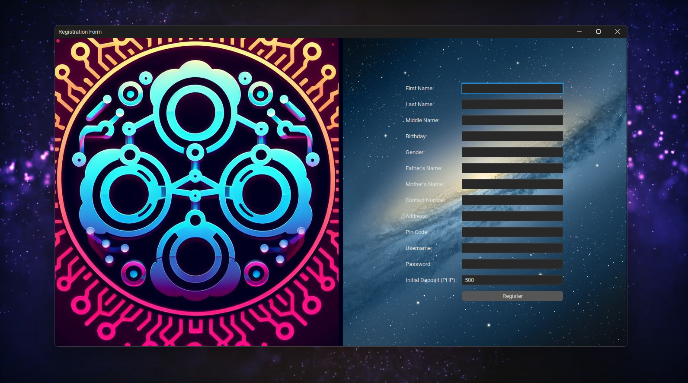
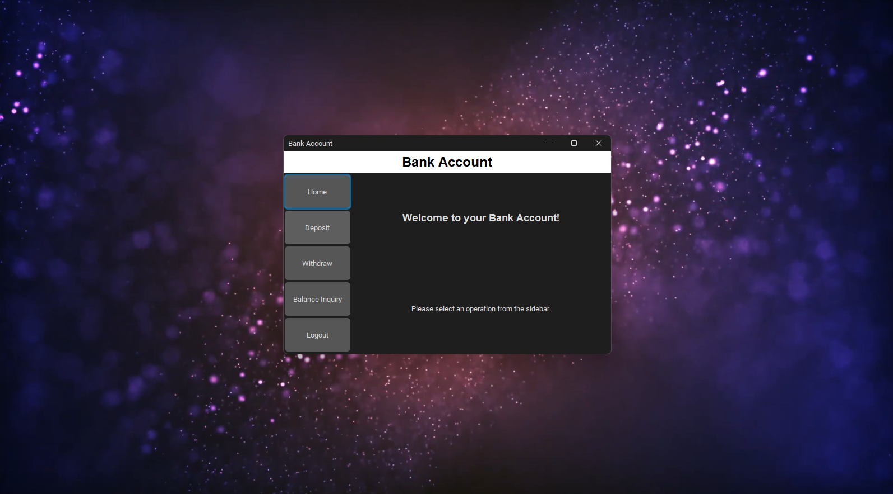
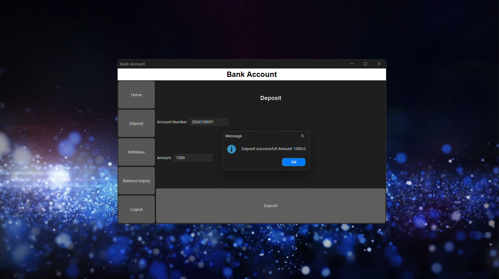
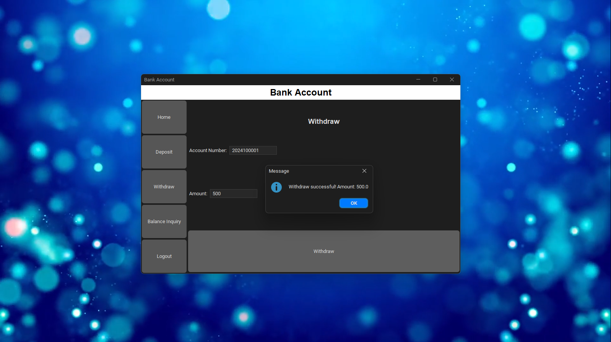

# 💫 CCPRGG2L INTERMEDIATE PROGRAMMING COM23P  

  
### Group Name: [Artificial Ledger Technology](https://github.com/Artificial-Ledger-Technology)  🇵🇭
### Subject & Section: 🧚‍♂️ [CCPRGG2L COM23P](https://www.youtube.com/watch?v=dQw4w9WgXcQ) 🧚‍♀️    
### Professor: 👦 [Jay D. Abaleta](https://www.youtube.com/watch?v=Zi_XLOBDo_Y)                    
### No. of Units: [3 Units](https://www.youtube.com/watch?v=d_Z-neEBuWM) 
### Prerequisite: [CCPRGG1L Fundamentals of Programming](https://github.com/flexycode/CCPRGG1L_FUNDAMENTALS_COM23P)       
### Course Repo: [CCPRGG2L Intermediate Programming](https://github.com/flexycode/CCPRGG2L_INTERMEDIATE_PROGRAMMING)               

# 📊 Table of Contents

- [Introduction](#introduction) 
- [Lesson](#lesson)           
- [Final Project](#final-project) 
- [Contributing](#contributing)           
- [License](#licensee)   
- [Acknowledgements](#acknowledgements) 
- [FAQ](#faq)       
- [Changelog](#changelogs)   


## [Introduction](#introduction)
This repository contains source code for our final project for intermediate java that focuses on Intermediate concepts, codes and exercises.

#### Course Description:
This course is a continuation of CCPRGG1L - Fundamentals of Programming. The course covers advanced topics in Java to train students in developing robust programs. Topics to be covered include recursion, regular expression, basic object-oriented principles, graphics, and multithreaded programming.

#### Course outcomes:
At the end of the course, the studend must be able to: 
1. Create a program that uses recursions and regular expressions
2. Implement Object-Oriented in program design
3. Create and document application that uses a modern graphical user interface (GUI)

###### ⚡ Course Outline: ACO -CI-F- 030(01) Course Outline - CCPRGG2L - COM   

## [Lesson](#lesson)              

### CCPRGG1L Table lecture
#### Course Outline and Timeframe

| Week No. | Date Coverage | Topic                                                | Reference                                                                                           |
|----------|---------------|------------------------------------------------------|-----------------------------------------------------------------------------------------------------|
| 1        | April 6       | Class Orientation                                   | Course Syllabus                                                                                     |  
|          |               | - Ø University Mission & Vision                     |                                                                                                     | 
|          |               | - Ø College Mission & Vision                        |                                                                                                     |   
|          |               | - Ø Course Syllabi                                  |                                                                                                     |  
|          |               | - Ø Lab Guidelines and Safety Review                |                                                                                                     |
| 2        | April 6       | Arrays                                               | Chapter 8&9 Java Programming Eight Edition, Farrell, Joyce                                        |    
| 3        | April 13      | File and String manipulation                         | Chapter 7&13 Java Programming Eight Edition, Farrell, Joyce                                       |
| 4        | April 20      | Recursion                                            | Chapter 2 Introduction to Programming in Java: An Interdisciplinary Approach, 2nd Edition, Robert Sedgewick |
|          | April 27      |                                                      | Chapter 13 Java Programming: From Problem Analysis to Program Design, Fifth Edition, Malik, DS     |
| 5        | May 4         | Regular Expression                                   | Chapter 30 Java: The Complete Reference Tenth Edition, Schildt, Herbert, 2018                     |
| 6        | May 11        | Introduction to Classes                              | Chapter 3 Java Programming Eight Edition, Farrell, Joyce                                          |
| 7        | May 18        | Composition, objects, and classes                    | Chapter 3 Introduction to Programming in Java: An Interdisciplinary Approach, 2nd Edition, Robert Sedgewick |
| 8        | May 25        | Instance method Inheritance Polymorphism             | Chapter 10 Java Programming: From Problem Analysis to Program Design, Fifth Edition, Malik, DS     |
| 9        | June 1        | Introduction to Swing package                        | Chapter 14 Java Programming Eight Edition, Farrell, Joyce                                         |
| 10       | June 8        | Interfaces and event-driven programming              | Chapter 10 Core Java: Volume II Advanced Features Tenth Edition, Hortsmann, Cay S., 2017           |
| 11       | June 15       | Threads                                              | Chapter 11 Java: The Complete Reference Tenth Edition, Schildt, Herbert, 2018                     |
| 12       | June 22       | Runnable interface Synchronization                   | Chapter 11 Core Java: Volume II Advanced Features Tenth Edition, Hortsmann, Cay S., 2017           |
| 13       | June 29        | Course Synthesis & Final Examination                 |                                                                                                     |


#### SUGGESTED READINGS AND REFERENCES 

* Java Programming Eight Edition, Farrell, Joyce, 2016 
* Object-Oriented Data Structures Using Java Fourth Edition, Dale, Nell,2018
* Java : The Complete Reference Tenth Edition, Schildt, Herbert, 2018
* Introduction To Programming in Java: An Interdisciplinary Approach Second Edition, Sedgewick, Robert, 2017
* Core Java: Volume II Advanced Features Tenth Edition, Hortsmann, Cay S., 2017
* Java Precisely Third Edition, Peter Sestoft, 2016

#### 💻 COURSE REQUIREMENTS

Assignments, Laboratory Exercises, Long Exam, Final Exam

#### 💻 GRADING SYSTEM                         

Other Learning Activities (20%)

(Assignment, Laboratory Exercise, Seatwork, Recitations, others)

Long Exams (40%)

Final Exam/Project (40%)

## [Final Project](#final)   
 
### 🏦 Artificial Ledger Technology Banking System 🔒  

#### Machine Problem:        

🚀 Construct a JAVA OOP program using Java Swing GUI environment for Personal New Bank Account, that the new user will Register the following information:

```bash
| Registration Form           |                     |   
|-----------------------------|---------------------| 
| First Name:                 | Middle Name:        |
| Last Name:                  | Gender:             | 
| Birthdate:                  | Father Name:        |
| Mother Name:                | Contact No:         |
| Address:                    | Pin code:           |
|-----------------------------|---------------------|  
| Username:                   | Password:           |
|                             |                     |
|                             |                     |
| Initial Deposit: 500        |                     | 
```

💱 The program will store all the information “NewAccount.txt” for the storage of the bank account, the program has feature of Deposit, Withdraw and Balance Inquiry. The initial deposit is the constant value 500 in the registration. Account No. will start at this default value. 2024100000. – new  

#### ⛓️ Program Requirements    

* Secure the Username and Password 

* Set an Exception handling to avoid Errors. 

#### ✨ Features 
- User Registration: Allows users to create an account and securely register their personal information.
- Account Management: Enables users to manage their bank accounts, including creating new accounts, viewing balances, and making transactions.
- Transaction History: Provides a detailed transaction history for each user, allowing them to track their financial activities.
- Security Measures: Implements robust security measures, such as encryption and authentication, to ensure the safety of user data.
- Create new bank accounts with unique account numbers and account holder names.
- Deposit money into existing accounts.  
- Withdraw money from existing accounts, with checks for sufficient balance.
- Check the current balance of an account.
- Display detailed information about an account.
- Registration Form Fantastic Background ( Video or Animated similar style when developing in NextJS)
- GUI for Login Form, Registration Form, Bank Account, etc.  
- Sound Effect ( Twitch - Alert, Japanese, Optimus Prime Robot voice prompt) 


#### 💻 Code Project Structure using [Maven](https://www.geeksforgeeks.org/what-is-maven)

Artificial Ledger Bank diagram tree using "package-by-features" or "package-by-components"     
```bash
ArtificialLedger.java 
│
├── src 
│   └── main
│       ├── java  
│       │   └── your.package.structure (ArtificialLedger) 
│       │       ├── components     
│       │       │      ├── EventHomeOverlay (💡Interfaces)                                           
│       │       │      ├── HeaderButton (components for Home)  
│       │       │      ├── BankAccount ( integration for Account, AccountManager, resources/account-details)   
│       │       │ 
│       │       ├── forms
│       │       │      ├── Account (🛸 GUI )       
│       │       │      ├──      
│       │       │      ├── Home ( Homepage )                         
│       │       │      ├── HomeOverlay (Home: )         
│       │       │      ├──   
│       │       │      ├── Login (📓Side Panel in Home ) 
│       │       │      ├── ModelLocation ( Extra: Background Video)
│       │       │      ├── RegistrationForm ( 🛸 GUI )                        
│       │       │
│       │       └── main                   
│       │       │      ├── Main ( 🚀 Application )                       
│       │       │  
│       │       │
│       │       ├── utils  
│       │              ├── RippleEffect (Extra:)        
│       │              ├── AccountManager (integration for Account, BankAccount, resources/account-details)    
│       │
│       │   
│       └── resources
│           └── account-details   
│           │     ├── account-details.txt              
│           │     └── account-details.txt      
│           │
│           └── images
│           │     ├── background-image-file.png
│           │     └── your-image-file.png
│           │          
│           └── voice-effect          
│                 └── voice-effect-file.wav                                          
│                    
├── pom.xml (or build.gradle, etc.)        
│ 
└── video
       ├── video 1.mp4
       ├── video 2.mp4
       └── video 3.mp4         
...  
```
#### Code Structure Explanation:

💻 The code tree structure that I provided follows the principles of a software architectural pattern known as the "Package by Feature" or "Package by Component" pattern. This pattern is commonly used in Object-Oriented Programming (OOP) and is particularly prevalent in frameworks and libraries that promote a modular and component-based approach to application development.

#### Code Requirements:
* 🚀 Download [VLC Media Player](https://www.videolan.org/vlc) 64 bit. Depends on your jdk version if lower jdk need 32 bit
* 🚀 Download and use [Intellij Idea Community Edition](https://www.jetbrains.com/idea/download/?section=windows)
* 🚀 Understand the Code Tree Structure of [Articial Ledger Bank](https://github.com/flexycode/CCPRGG2L_INTERMEDIATE_FINAL_EXAM?tab=readme-ov-file#-code-project-structure-using-maven)
* 🚀 Locate the designated important file such as video, resources file like wav, png, jpg in appropriate directory file in your Idea folder located in your system drive or C:\drive.
Example: C:\Users\eimifukuda\IdeaProjects\ArtificialLedger\

##### The best IDE to run this Application is to use IntelliJ IDEA Community Edition

* 💻 IntelliJ IDEA Community Edition - Good for personal project, Git Integration features and tons of useful features, easy to use and eye freshing UI theme. The only downside of this is that you need to enable your Microsoft security anti-malware to be able to install this IDE. You cannot store multiple java project unlike Eclipse.
   
* 💻 Eclipse - Best choice for every Java Developer out there, best for storing multiple java project because of the workspace features on this IDE. But if you're trying to run this project, you need to downgrade your JDK version into 8 and figure-out how to crack those installation lols.   

* 💻 Visual Studio Code - I've never try to run this project in this IDE during the development period. The only main issue on this IDE is that you need to figure-out what extention to be install before you can run your Java file.          

* 💻 XCode - I dont know, I don't have Macbook and not a fan of that $hit lols.

* 💻 Apache Netbeans - I just saw this IDE on Youtube tutorial, good for designing GUI and UI for java project. Best IDE for Java development to use and to know if you want to become a Java Developer lols. 

* 💻 Vim - Do you want your life to become miserable? Use this IDE instead :D

* 💻 NeoVim - IDE for Alien being, not human being.     

# 🏦 Artificial Ledger Bank - Preview        
#### Artificial Ledger Technology Bank "The Bank that you can trust” – Powered by Blockchain Technology #Web3 Philippine By ArtificialLedger
### Home Page 


### Login Panel


### Registration Form        
      


### Bank Account Transaction GUI      
    


### Deposit          
    


### Withdraw   



### Balance Inquiry 


### Quality Assurance Testing


# 🏆 Contributing     

### Contributing     
If you would like to contribute to the Banking System, please follow these steps:
1. Fork the repository.
2. Create a new branch for your feature or bug fix.
3. Make your changes and commit them.
4. Push your changes to your forked repository.
5. Submit a pull request to the main repository.

### 🧠 Submitting Changes

🧠 Contributions are welcome! If you have ideas for improvements or want to add more exercises, follow these steps:

1. Fork the repository.
2. Create a new branch.
3. Make your changes and commit them.
4. Push to your fork and submit a pull request.

### 👋 Contributors
### Special thanks to all my groupmates: 
 * ####  😎 [Jay Arre Talosig](https://github.com/flexycode) - Chief Technology Officer | Blockchain Developer | Bioinformatics Scientist    
 * ####  😃 [Gabriel Angelo Viñas](https://github.com/IYB-Mata) - Tech Lead | Software Engineer III | Machine Learning Engineer  
 * ####  🥰 [Anilove Tiquio](https://github.com/tiquioani) - Project Lead | Software Quality Assurance SQA | Digital Forensics Analyst                    
 * ####  🤗 [Kristine Vine Navarro](https://github.com/Kristine2811) - Team Lead | Software Developer | Full-Stack Engineer               
 * ####  😌 [Joshua Maquilan](https://github.com/Primorion)  -  Quality Assurance Tester QAT | Information Security Specialist | Software Engineer  
 * ####  😋 [Vince Erol Pangilinan](https://github.com/vinceeee4) - Software Engineer | Full-Stack Developer | Mobile Developer               
 

### 🛸 Reporting Issues

```bash
Some changes need to be address
- Need to limit the Pin Code to 6 character input only just like in the Real Bank, example 123456
- Fix the GUI for Login and Account Class
- Fix some method in Account Class, for every transaction such Withdrawal, Deposit and Balance Inquiry. It needs to have Pin Code for every transaction.

```

###### 🤖 If you encounter any issues or have suggestions, please open an issue to let us know.

# 🔭Acknowledgements     

### ✨ Professor Jay A. Abaleta   
Professor Jay Abaleta is a Senior Software Engineer and esteemed faculty member at National University. With a strong background in teaching the core principles and advanced concepts of Java, he is highly regarded in the field. In addition to his role at National University, Prof. Abaleta also serves as a Professor at Adamson University and as a lecturer of IT/CS at Arba Minch University, sharing his expertise with students worldwide. Having studied at St. Paul University Philippines, Prof. Abaleta brings a wealth of knowledge and experience to his teaching. Known for his friendly and approachable nature, Prof. Abaleta fosters a positive learning environment where students thrive. His dedication and passion for teaching have made him a beloved professor among his students.

# 🔑 License     

The Artificial Ledger Technology Bank App is licensed under the [MIT License](https://opensource.org/licenses/MIT) and [ALT Licence](https://github.com/flexycode/CCPRGG2L_INTERMEDIATE_FINAL_EXAM/blob/master/LICENSE).
This project is licensed under the MIT License and Artificial Ledger Technology.
    
# 📫 Changelogs 

Chronological list of updates, bug fixes, new features, and other modifications for our Artificial Ledger Technology Bank System Appplication.

## [4.1.4] - 2024-06-8      
### Added
- 💻 Professor Jay discus the Final Project requirements for out project  
- ✨ Coming Soon 💻 🚀
- ✨ Coming Soon 🧠 🔑

## [4.1.4] - 2024-06-9 
### Activity
- ✨ Brainstorming for our Project requirements 
- ✨ Anilov set our first Agile Scrum meeting througout MS Teams to discuss the Project needs and requirements throughout the given 2 weeks sprint.

## [4.1.4] - 2024-06-10 
### Activity 
- ✨ Jay managed to create a Kanban Board for our 2 weeks sprint task

## [4.1.4] - 2024-06-11 
### Activity 
- ✨ Jay succesfully created the project repository in the GITHUB and distributed the assign tasks to all members 

## [4.1.4] - 2024-06-12 
### Activity 
- ✨ Coming Soon

## [4.1.4] - 2024-06-13 
### Activity 
- ✨ Kristine setup our second meeting via Microsoft Teams to discuss the progress of the project

## [6.1.1] - 2024-06-14 
### Activity 
- ✨ Coming Soon

## [6.2.1] - 2024-06-15 
### Activity 
- ✨ Anilov & Kristine setup our third meeting via Microsoft Teams to discuss the progress of our project

## [6.3.1] - 2024-06-16 
### Activity 
- ✨ Coming Soon...

## [6.4.1] - 2024-06-17 
### Activity 
- ✨ Coming Soon

## [6.5.1] - 2024-06-18 
### Activity 
- ✨ Coming Soon
 
## [6.6.4] - 2024-06-19 
### Activity 
- ✨ Anilov & Kristine setup our fourth meeting via Microsoft Teams to discuss the progress of our project 

## [6.7.4] - 2024-06-20 
### Activity 
- ✨ Anilov finalizing the Software Development Life Cycle documentation

## [6.8.2] - 2024-06-21
### Activity 
- ✨ Gabriel debugged the Account class and fixed some method in Login and RegistrationForm Class
- ✨ Jay added a Pin Code feature that authenticate after successfully sign-in in the Login Class

## [6.9.1] - 2024-06-22 
### Activity 
- ✨ Thesis defense for our Final Project

#### [Back to Table of Content](#introduction)
